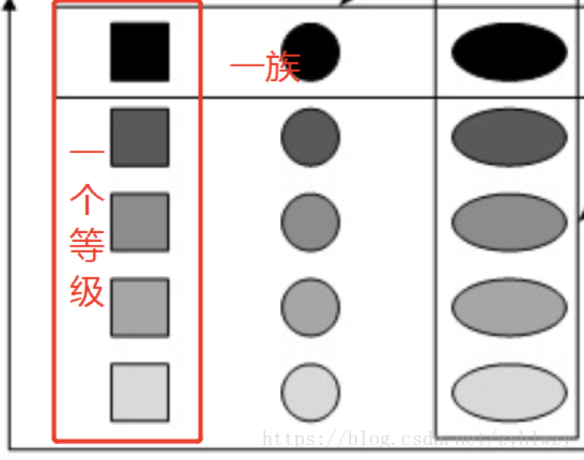

# 浅入浅出三种工厂模式

## 引言（设计模式的目的）

我们常说设计原则，设计模式。到底设计模式是如何出现的？设计模式的目的是什么呢 ？
相信各位读者或多或少都听过，SOLID设计原则，20+中设计模式中的一些术语。

设计模式首次被提出是出现在GoF的《Design Patterns - Elements of Reusable Object-Oriented Software》一书。自此之后GoF 23种设计模式常常出现在各个论坛。
GoF其实也是Gang of Four的简称。

那么归根结底，其目的是什么？
设计原则是几种理念的总结，其主要代表的是实现系统的**高内聚、低耦合**，并且同时找到系统的变化点，使用一些技术手段实现**分离变化与稳定**。进而保证软件系统的**高可重用性、高可扩展性、高可靠性**。

设计模式是基于设计原则的一些实践方法模式，其未必能满足所有的原则，但会有其专有的一些特点，以适用不同的系统场景。
曾有老师将学习设计模式的程度分为四境界，此处做一引用

>第一阶段：手中无剑，心中无剑
>第二阶段：手中有剑，心中无剑
>第三阶段：手中有剑，心中有剑
>第四阶段：手中无剑，心中有剑

本文主要针对**三种工厂模式（简单工厂、工厂方法、抽象工厂）**进行简单的介绍和场景分析。

**注：**

*若读者已达到第三阶段，可以直接command+q 或 alt+F4 退出，以免浪费时间。*

*本文示例代码有所精简，具体代码可查看[Github Repo](https://github.com/dragonwang-hub/three_factory_design_patterns)*


## 需求及基础实现（加减乘除）

首先，从一个Demo讲起，现在有一个简单的功能开发，需求如下：

使用任一面向对象语言实现一个计算器控制台程序
1. 实现基本四则运算（+ - * /）
2. 只需要两个数字输入
3. 需要保证程序的可复用性

相信，任何一个对面向对象三特性有些了解的读者都会写出如下程序：

```java
public class Operation {
    private double numberA;
    private double numberB;

		// setter and getter

    double getResult(String operate) {
        double result = 0d;
        switch (operate) {
            case "+":
                result = numberA + numberB;
                break;
            case "-":
                result = numberA - numberB;
                break;
            case "*":
                result = numberA * numberB;
                break;
            case "/":
                result = numberA / numberB;
                break;
            default:
                System.out.println("Input operate is incorrect!");
        }
        return result;
    }
}

```

一个封装的Operation类，其内使用switch分支判断选择运算的算法。调用方只需要传入数字和运算符即可获得结果。

针对需求，这段代码已经实现的比较不错了，使用封装特性将业务逻辑进行封装，降低了调用方与业务方的耦合。
但如果现在要添加一个幂运算，程序**只能在switch中增加新分支**。其次，此处运算算法（分支内内容）相当简单，若在复杂系统中，算法极其复杂，将会造成其switch分支包含过多职责的情况，而且，若是某分支的算法需要进行更改，则需要修改Operation类的内容。

仔细分析需求，观察此段代码，运算数字只有两个，分支中唯一的区别在于运算符。
若能**将具体的运算算法和数字初始化进行分离解耦**，则便可以降低Operation的职责，再次进行解耦。因此可以构造父子类，赋予不同子类处理不同的运算算法。

```java
public class Operation {
    private double numberA = 0d;
    private double numberB = 0d;
		// setter and getter
}

public class OperationAdd extends Operation {
    @Override
    public double getResult() {
        return getNumberA() + getNumberB();
    }
}

public class OperationDiv extends Operation {
    @Override
    public double getResult() {
        return getNumberA() / getNumberB();
    }
}

public class OperationMul extends Operation {
    @Override
    public double getResult() {
        return getNumberA() * getNumberB();
    }
}

public class OperationSub extends Operation {
    @Override
    public double getResult() {
        return getNumberA() - getNumberB();
    }
}
```

```java
public class MainClass {
    public static void main(String[] args) {
				// ...
        Operation operation = null;
        switch (operate) {
            case "+":
                operation = new OperationAdd();
                break;
            case "-":
                operation = new OperationSub();
                break;
            case "*":
                operation = new OperationMul();
                break;
            case "/":
                operation = new OperationDiv();
                break;
            default:
                System.out.println("Input operate is incorrect!");
        }
        operation.setNumberA(numberA);
        operation.setNumberB(numberB);
        double result = operation.getResult();
        System.out.println("The result is :" + result);
    }
}

```

使用这种系统结构，保证内部封装，和职责分离。但调用方依然在运算前需要进行分支选择实例化不同的对象。

对于调用者而言，其本不需要也不希望进行处理创建对象逻辑，其只需要传入参数调用方法计算结果即可。

因此，可以将**分支选择实例化对象部分**从此类进行剥离，构建工厂类。实现**对象创建和对象使用的分离解耦**。这就构成了一种简单的设计模式——简单工厂模式。

## 简单工厂模式

简单工厂包含三个角色：

- Factory：负责创建所有产品示例的内部逻辑
- Abstract Product：所有产品对象抽象的父类，负责描述所有产品共有的公有接口
- Concrete Product：负责创建具体产品实例


简单工厂的实现目的：

1. 对象创建和对象使用进行分离，解耦。
2. 创建由工厂执行。Client只需要关注如何使用，甚至无需知道具体产品的类名

因此，对于上述的四则运算示例，使用简单工厂模式实现，如下所示：


**注： 代码可查看[Github Repo](https://github.com/dragonwang-hub/three_factory_design_patterns)**

使用一个工厂根据分支创建不同运算实例，进而通过调用方使用实例求解出具体结果。
实现了对象创建和使用的解耦，保证了运算算法的职责单一，只需要调用方传入参数，即可获取相应对象实例，并进行使用。

即使此时需要新增一两个运算法则，也只需要小改Operation类，增加新的具体产品类即可，但依然需要更改原有类结构。

若要增加一些运算法则，简单工厂模式又会显得力不能及。因为一旦将所有产品创建都放在一个工厂类，会使得该工厂类的职责过于庞大，进而引入一些新问题，这就是简单工厂模式的缺点。

1. **工厂类不够灵活**，增加新的具体产品需要修改工厂类的判断逻辑代码，而且产品较多时，工厂方法代码将会非常复杂。
2. 增加系统中类的个数，在一定程序上增加了系统的复杂度和理解难度。
3. 依然**没有完全符合开闭原则**，增加新功能，依然需要修改工厂类。

如果对工厂类灵活性有一定要求，并要保证完全符合开闭原则，可以选择使用工厂模式。

## 工厂模式

工厂模式包含四个角色：

- Abstract Factory：作为工厂方法模式的核心类，声明工厂方法，用于返回一个产品
- Concrete Factory：抽象工厂类的子类，实现工厂方法，以供调用方调用，负责创建对应产品
- Abstract Product：所有产品对象抽象的父类，负责描述所有产品共有的公有接口
- Concrete Product：负责实现抽象产品接口，由专门的具体工厂创建，一一对应


工厂模式在简单工厂模式基础进行改造，声明核心工厂类和对应每个产品的具体工厂类，用于实现动态创建每一个产品。在工厂模式中：

1. 核心的工厂类不再负责所有产品的创建，而是将具体创建工作交给子类去实现。
2. 实现了系统在不修改工厂角色的情况下增加新产品，保证了**只扩展，不改变**（开闭原则）。

对于四则运算示例，其使用工厂模式实现，如下所示：


**注： 代码可查看[Github Repo](https://github.com/dragonwang-hub/three_factory_design_patterns)**

使用核心工厂接口声明创建运算产品的工厂方法，再针对每个具体运算产品的创建去实现核心工厂类。因此，对于每种产品就有了其一一对应的具体工厂类。
当需要在系统中创建任何新的运算算法，都只需要编写相应的运算产品类和对应的工厂类。调用方在使用时直接实例化工厂实例，进而使用工厂对象生产产品实例再使用即可。

**既实现了对象创建和对象使用的分离解耦，又保证了系统的高灵活性、高扩展性。**

当然相对应简单工厂模式，虽然工厂模式**提高了系统的灵活扩展性**，但相应的也增加了系统的代码复杂度。每需增加新产品时，则需要编写新的产品类和对于工厂类。

工厂方法中，具体工厂和具体产品是一一对应。**每个工厂只会生产对应的一种产品**。但是有时候需要一个工厂提供多个产品对象，工厂模式就出现局限性。
比如针对上例，上例预算中所有的运算方法都没有对结果进行处理。现在需要针对四则运算的结果进行严格保留两位小数，并保证原有功能不变，可随意切换严格运算模式和普通运算模式。

**需求变更：**

针对这个需求变化，若直接在工厂模式上进行扩展，则会产生八个具体工厂类和对应的八个产品类。那么如何简化代码结构呢？这就引入了我们的抽象工厂模式，采用一个工厂类生产多个处于同一等级结构的产品实例。

## 抽象工厂模式

若要了解抽象工厂模式，需要明确两个概念：

- 产品等级结构：表示产品的继承结构，主要是有继承关系的一系列的类结构。
- 产品族：由一个工厂创建，包含处于不同产品等级结构的一组产品。产品族内产品也具有一定关系。

如果你还有疑惑，请看下图示例：

所有不同颜色的矩形可以继承于矩形父类，其作为一个产品等级结构。
每个工厂类可以创建处于同一等级结构的一组产品，这组产品也就是产品族。



抽象工厂模式是所有形式的工厂模式中最为抽象和最具一般性的一种形态。

抽象工厂模式也包含四个角色：

- Abstract Factory：声明生成抽象产品的方法，存在多个，针对每个产品等级结构都有不同的抽象产品类
- Concrete Factory：抽象工厂类的实现类，负责创建一个产品族。
- Abstract Product：所有产品对象抽象的父类，负责描述所有产品共有的公有接口
- Concrete Product：负责实现抽象产品接口中定义的业务方法


**抽象工厂与工厂模式最大区别**在于：工厂模式只针对一个产品等级结构，抽象工厂模式却可以面向多个产品等级结构。
因此，抽象工厂是最具有一般性的一种形态。当系统需要工厂生产的产品不是一个对象，而是一组对象时，就需要使用抽象工厂模式。使用抽象工厂，可以实现：

1. 具体工厂都实现了抽象工厂中定义的那些公共接口, 实现高内聚低耦合的设计目的
2. 可以面向多个产品等级结构进行系统设计，并且保证调用方始终只使用同一个产品族中的对象。

需要明确的一点在于，使用抽象工厂模式时，调用方只会同时使用同一产品族的对象。

那么针对运算示例新增加的严格运算模式的需求，使用抽象工厂实现示例如下：


**注： 代码可查看[Github Repo](https://github.com/dragonwang-hub/three_factory_design_patterns)**

此处，对工厂类进行综合修改，保证每个工厂类可以创建一个产品族。因此，针对每个运算操作都抽象出相应的抽象产品类，并分别进行实现，构造了四个产品等级结构。这样就可以保证调用方**每次选择一个统一的产品族**使用。

相对而言，其结构较为复杂，而且也存在一些缺点

- 增加新产品族时，只需新增工厂类和对应不同等级结构的产品类。但需要增加文件过多，以至于太复杂。
- 增加新的等级结构时，会对原有的具体工厂类进行改变，在其类内增加新方法，在一定程度不符合开闭原则。增加新产品族时不存在此问题。（**开闭原则倾斜性**）


因此，抽象工厂模式中，更适用于**具有多个产品等级结构**的场景。为了更好的说明抽象工厂模式的使用场景，我们将引入一个被玩烂的示例，DB Demo：

简单描述：调用方需要适应多种数据库进行增删改查，数据库类型可以自定义更换。现有数据库包括Sqlserver和Access，但之后可能会引入Mysql等其他数据库。

这就需要设计的系统结构必须支持多个产品族的创建。使用抽象工厂模式直接创建具体工厂类，每个工厂类负责创建当前需求所需要使用的一系列表（产品族）。


**注： 代码可查看[Github Repo](https://github.com/dragonwang-hub/three_factory_design_patterns)**

从这个实例中很容易感受到抽象工厂的魅力，调用方在某一时段只会选择一种数据库使用。使用抽象工厂模式创建多个产品族，在使用时直接指定某一产品族即可。

假设，现在要求增加一个新表，并且新表也有增删改查一套功能。则需要增加对应的产品等级结构，并在每个具体工厂类中，增加创建新表对象的方法。若此时系统已兼容多个数据库，则这一点需求的增加，就会导致大量代码文件的修改。

基于这类情况，提出新的思路，将所有工厂类揉合成一个工厂类，将抽象工厂退化为简单工厂，保证在要求增加一个新表，只需要改动一个工厂类即可。这时候，可能有读者会有所思考，那么简单工厂类中那些无处安放的分支选择语句是否应该处理呢？如果有多个产品对象，其对应的分支选择也必然十分庞大。

既然提出了问题，自然是需要解决的。

## 反射+简单工厂模式（DB Demo）

针对上述DB Demo的抽象工厂示例，在将其简化为简单工厂后，使用反射技术，通过**配置文件配置相应使用的产品族**，当更换产品族时，不需更改任何业务代码，只需要修改配置文件即可。用反射技术去除分支选择语句可以**解除分支选择带来的耦合**，进而提高可扩展性。

代码示例如下：

```java
// 简单工厂类，创建所有产品
public class DataAccess {

    public static String DB = "";

    public static IUser createUser() {
        String classFullName = "AFdbdemo.reflectaddsimplefactory.product.user." + DB + "User";
        IUser iUser = null;
        try {
            iUser = (IUser) Class.forName(classFullName).newInstance();
        } catch (Exception e) {
            e.printStackTrace();
            System.out.println("Failed to Create User Table, DB is" + DB);
        }
        return iUser;
    }

    public static IDepartment createDepartment() {
        String classFullName = "AFdbdemo.reflectaddsimplefactory.product.department." + DB + "Department";
        IDepartment iDepartment = null;
        try {
            iDepartment = (IDepartment) Class.forName(classFullName).newInstance();
        } catch (Exception e) {
            e.printStackTrace();
            System.out.println("Failed to Create Department Table, DB is" + DB);
        }
        return iDepartment;
    }
}
```

```java
    // 静态初始化块，初始化选择的数据库
		static {
        Properties properties = new Properties();
        try {
            properties.load(new FileInputStream("src/AFdbdemo/reflectaddsimplefactory/setting.properties"));
        } catch (IOException e) {
            e.printStackTrace();
        }
        DataAccess.DB = properties.getProperty("DB");
    }
```

相应系统结构与简单工厂一样。只是在工厂类中，不再使用分支选择去判断创建何种对象实例，使用反射技术直接实例化所需对象。


**注： 代码可查看[Github Repo](https://github.com/dragonwang-hub/three_factory_design_patterns)**

反射技术相对于简单工厂，其代码更复杂，同时也增加了些许资源消耗，比较适合对灵活性和扩展性要求高的场景。

***因作者当前水平有限，针对此节，若有错误，请多包含。若对反射技术有更深了解需求，请持续关注或转战他场。***

## 总结（适用场景）

针对三种工厂模式，优缺点及适用场景如下表：

|          | **简单工厂模式**                                             | **工厂模式**                                                 | **抽象工厂模式**                                             | **反射+简单工厂**                                            |
| -------- | ------------------------------------------------------------ | ------------------------------------------------------------ | ------------------------------------------------------------ | ------------------------------------------------------------ |
| 优点     | 1.对象创建和对象使用进行分离，解耦。  2.创建由工厂执行。Client只需要关注如何使用，甚至无需知道具体产品的类名 | 1.保持了简单工厂模式的优点  2.增加新的产品类时无须修改现有系统，只需扩展，无需改变。  3.系统具有良好的灵活性和可扩展性 | 1.隔离了具体类的生成，实现高内聚低耦合  2.保证客户端始终只使用同一个产品族中的对象  3.符合“开闭原则”（但具有倾斜性）  4.最为抽象和最具一般性的一种形态。 | 1. 引入配置文件，可以在不修改任何客户端代码的情况下更换和增加新的具体产品类，在一定程度上提高了系统的灵活性。 |
| 缺点     | 1.工厂类职责过大  2.系统扩展困难（不完全满足开闭原则）  3.增加了类的个数 | 1.增加新产品需要同时增加新工厂类，增加了复杂性               | 1.增加新的产品等级结构麻烦                                   | 1.增加了资源消耗  2.代码相对复杂（相对简单工厂）             |
| 适用场景 | 1.工厂类所需负责的对象较少。  2.客户端无需关注创建对象细节   | 1.工厂类负责创建对象较多，且需要高扩展性  2.客户端无需关注创建对象细节  3.面对一个产品等级结构 | 1.面对多个产品等级结构，多个产品族。但每次只使用其中某一产品族。  2.系统提供一个产品类的库，所有的产品以同样的接口出现，从而使客户端不依赖于具体实现。 | 灵活性和扩展性要求高的场景                                   |

>书中曾言：
>
>当抽象工厂模式中每一个具体工厂类只创建一个产品对象，也就是只存在一个产品等级结构时，抽象工厂模式退化成工厂方法模式；
>
>当工厂方法模式中抽象工厂与具体工厂合并，提供一个统一的工厂来创建产品对象，并将创建对象的工厂方法设计为静态方法时，工厂方法模式退化成简单工厂模式

作者认为：不管黑猫白猫，能抓住老鼠，必然是好猫。所以众工厂模式中，没有优劣，只有合适与否。

# Reference

本文部分图片和文字来源于各大博主。

1. [【设计模式】简单工厂、工厂方法与抽象工厂的区别](https://blog.csdn.net/jerry11112/article/details/80618420?utm_medium=distribute.pc_relevant.none-task-blog-2%7Edefault%7EBlogCommendFromMachineLearnPai2%7Edefault-2.control&dist_request_id=1330144.24999.16181468673066339&depth_1-utm_source=distribute.pc_relevant.none-task-blog-2%7Edefault%7EBlogCommendFromMachineLearnPai2%7Edefault-2.control)
2. [使用反射增强简单工厂设计模式](https://developer.aliyun.com/article/24335)
3. 《大话设计模式》

**本文所有Demo代码见[Github Repo](https://github.com/dragonwang-hub/three_factory_design_patterns)**

